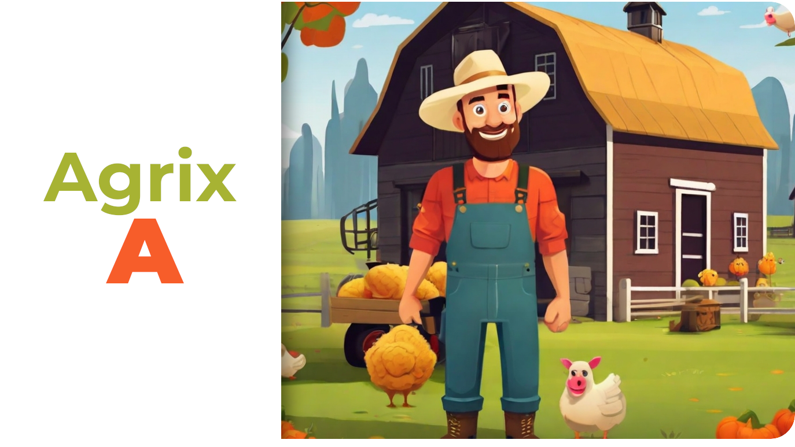

# :deciduous_tree: Agrix - fase "A"

Maria e João são pessoas empreendedoras que estão muito preocupadas com os impactos ambientais e sociais dos nossos processos agrícolas. Por isso, decidiram criar a AgroTech, uma empresa especializada em tecnologias para melhorar a eficiência no cultivo de plantações. Isso visa reduzir o desperdício de recursos em geral e de alimentos em específico, fazendo um uso mais responsável da terra disponível para plantio.

 

O primeiro produto dessa empresa será o **Agrix**, um sistema que permitirá a gestão e o monitoramento das fazendas participantes. Esse produto será desenvolvido em três fases.

 
 

### :dart: Fase "A"

Nesta etapa inicial o foco é desenvolver uma aplicação Spring Boot com algumas funcionalidades iniciais, e que servirá de base para as próximas fases, além de consolidar os meus conhecimentos no ecossistema java/spring desenvolvendo rotas, aplicação de injeção de dependência para conectar as camadas de controle, serviço e persistência, uso do *Spring Data JPA*, gerenciamento de erros no *spring Web* e a conteinerização com Docker.

---

## Requisitos

:one: Criar uma API para controle de fazendas com a rota POST `/farms`.

:two: Criar a rota GET `/farms`.

:three: Criar a rota GET `/farms/{id}`.

:four: Criar a rota POST `/farms/{farmId}/crops`.

:five: Criar a rota GET `/farms/{farmId}/crops`.

:six: Criar a rota GET `/crops`.

:seven: Criar a rota GET `/crops/{id}`.

:eight: Criar um *Dockerfile* para a aplicação.

---

## Confira as etapas seguintes

 - [x] [Agrix - fase B](https://github.com/wellison-md/agrix-b)
 - [x] [Agrix - fase C](https://github.com/wellison-md/agrix-c)
